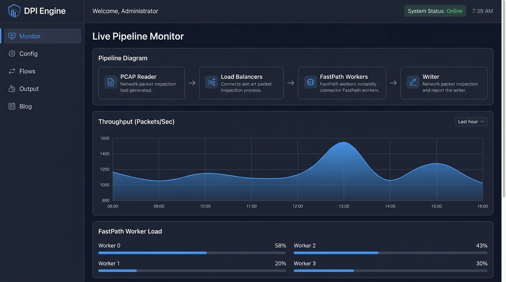
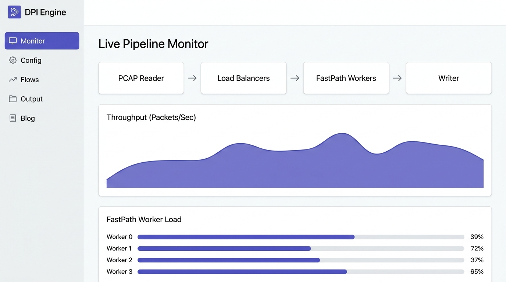
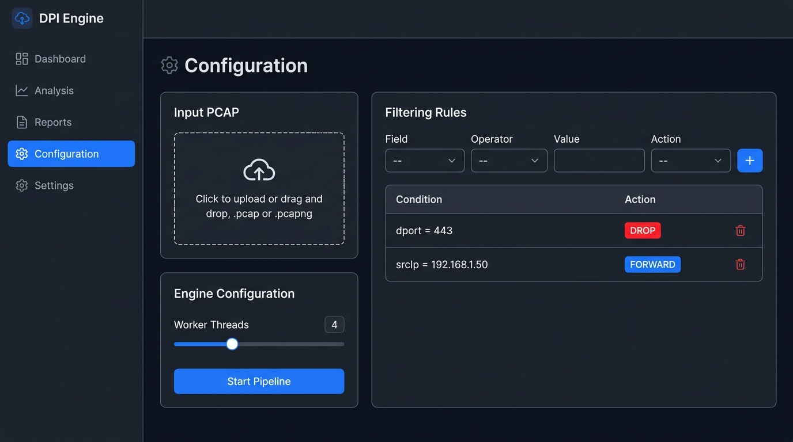
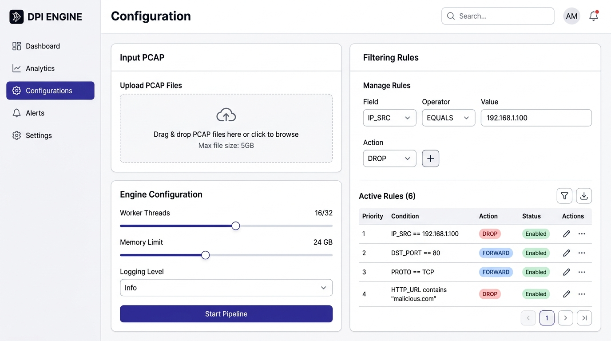
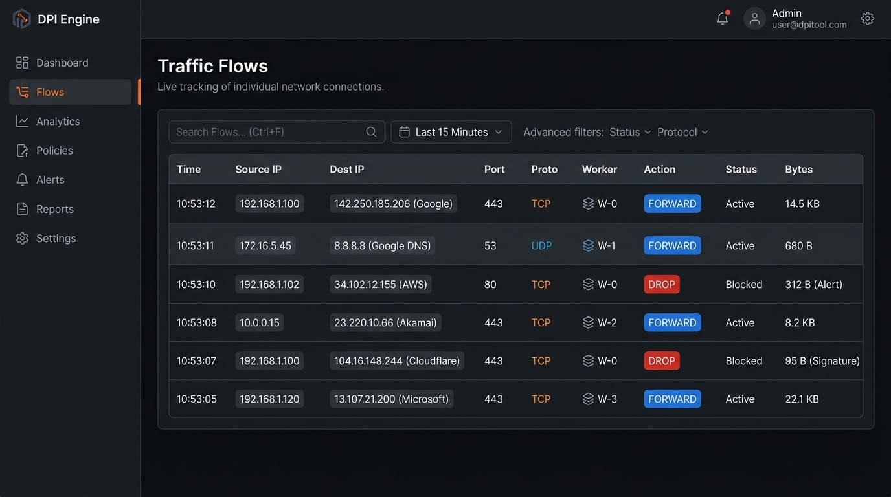
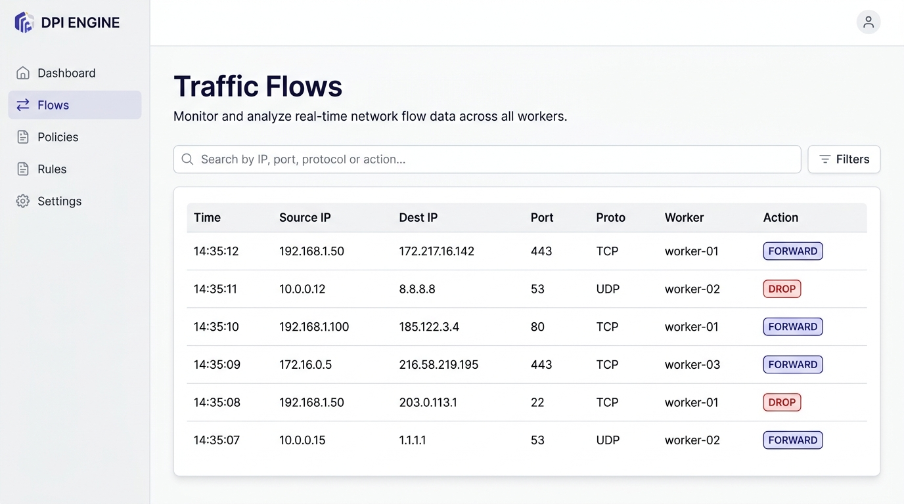
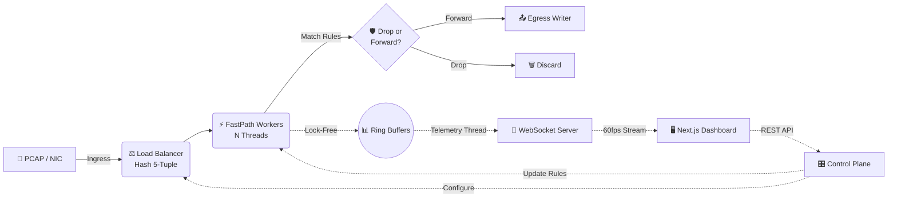

<div align="center">

# 🛡️ DPI Engine

### High-Performance Deep Packet Inspection & Real-Time Telemetry Dashboard

[](https://nextjs.org/)
[](https://openjdk.org/)
[](https://www.typescriptlang.org/)
[](https://tailwindcss.com/)
[](https://www.python.org/)
[](LICENSE)

A production-grade network packet inspection platform featuring a multi-threaded **Java FastPath engine** for wire-speed packet dissection and a responsive **Next.js 15 dashboard** for real-time visualization and control.

[Live Demo](#) · [Report Bug](https://github.com/dwivedyarvind67/DPI/issues) · [Request Feature](https://github.com/dwivedyarvind67/DPI/issues)

</div>

---

## 📸 Dashboard Preview

<table>
  <tr>
    <td align="center"><strong>🌙 Dark Mode</strong></td>
    <td align="center"><strong>☀️ Light Mode</strong></td>
  </tr>
  <tr>
    <td></td>
    <td></td>
  </tr>
  <tr>
    <td colspan="2" align="center"><em>Live Pipeline Monitor — Real-time throughput chart, pipeline diagram, and per-worker load bars</em></td>
  </tr>
  <tr>
    <td></td>
    <td></td>
  </tr>
  <tr>
    <td colspan="2" align="center"><em>Configuration — PCAP upload, worker thread tuning, and dynamic filtering rules</em></td>
  </tr>
  <tr>
    <td></td>
    <td></td>
  </tr>
  <tr>
    <td colspan="2" align="center"><em>Traffic Flows — Sortable, filterable table of every inspected connection</em></td>
  </tr>
</table>

---

## ✨ Key Features

| Category | Details |
| :--- | :--- |
| **FastPath Architecture** | Multi-threaded packet processing engine capable of handling millions of packets per second without frame loss. |
| **Lock-Free Ring Buffers** | Zero-contention telemetry collection — the data plane never blocks on locks or I/O. |
| **Dynamic Rules Engine** | Create, update, and delete L3/L4 filtering rules on the fly (IP, port, protocol). |
| **Deep Packet Inspection** | Extracts TLS SNI, DNS queries, and HTTP hostnames from packet payloads for application-layer classification. |
| **Real-Time Dashboard** | 60 fps live throughput charts, individual worker load bars, and active flow tables driven by WebSockets. |
| **Dual Theme** | Seamless light and dark mode toggle with a professional, clean design system. |
| **PCAP Download** | Download the filtered output PCAP after processing for offline analysis in Wireshark. |

---

## 🏗️ Architecture



---

## 🛠️ Tech Stack

### Frontend — `pcap-dashboard/`

| Technology | Purpose |
| :--- | :--- |
| [Next.js 15](https://nextjs.org/) (App Router) | React framework with server components |
| [TypeScript](https://www.typescriptlang.org/) | Type-safe application logic |
| [Tailwind CSS v4](https://tailwindcss.com/) + [shadcn/ui](https://ui.shadcn.com/) | Design system and UI primitives |
| [Zustand](https://zustand-demo.pmnd.rs/) | Lightweight global state management |
| [Recharts](https://recharts.org/) | Real-time data visualization |
| [TanStack Table](https://tanstack.com/table) | Headless, sortable, filterable data tables |
| [Lucide React](https://lucide.dev/) | Icon library |

### Backend — Java DPI Engine

| Technology | Purpose |
| :--- | :--- |
| Java 21 | High-performance packet processing engine |
| Custom PCAP Parser | Native binary reader for `.pcap` file format |
| TLS/DNS/HTTP Dissectors | Protocol-aware deep packet inspection modules |
| Rules Engine | Dynamic packet classification and filtering |
| PCAP Writer | Outputs filtered traffic to a new `.pcap` file |

### Testing — Python Automation

| Technology | Purpose |
| :--- | :--- |
| Python 3 + Scapy | Synthetic PCAP generation with realistic TLS/DNS/HTTP traffic |
| Automated Test Suite | 7-test pipeline: compile → run → validate → report |

---

## 🚀 Getting Started

### Prerequisites

- **Node.js** 18+ and **npm**
- **Java JDK** 21+
- **Python** 3.x (for running the test suite)

### 1. Clone the Repository

```bash
git clone https://github.com/dwivedyarvind67/DPI.git
cd DPI
```

### 2. Run the Frontend Dashboard

```bash
cd pcap-dashboard
npm install
npm run dev
```

Open [http://localhost:3000](http://localhost:3000) in your browser.

### 3. Run the Backend Engine Tests

From the project root:

```bash
python test_dpi_engine.py
```

This automated suite will:
1. Generate a test PCAP with 97+ synthetic packets (TLS, DNS, HTTP traffic from 20+ domains).
2. Compile the entire Java DPI engine.
3. Run the engine with no rules, application blocking, IP blocking, and combined rules.
4. Validate the filtered output PCAP for integrity.

Expected output:

```
============================================================
  TEST SUMMARY
============================================================
  [+] PASS  Test 1: Generate the test PCAP file.
  [+] PASS  Test 2: Compile the Java engine.
  [+] PASS  Test 3: Run the DPI engine with no blocking rules.
  [+] PASS  Test 4: Run the DPI engine with application blocking.
  [+] PASS  Test 5: Run the DPI engine with IP blocking.
  [+] PASS  Test 6: Run with combined blocking rules.
  [+] PASS  Test 7: Verify the output PCAP file is valid.

  Total: 7  Passed: 7  Failed: 0
  All tests passed!
============================================================
```

### 4. Deploy to Production

[](https://vercel.com/new/clone?repository-url=https%3A%2F%2Fgithub.com%2Fdwivedyarvind67%2FDPI&root-directory=pcap-dashboard)

One-click deploy the frontend dashboard to Vercel. The platform auto-detects the Next.js configuration.

---

## 📂 Project Structure

```
DPI/
├── pcap-dashboard/              # Next.js 15 Frontend
│   ├── app/                     # App Router pages
│   │   ├── monitor/             # Live pipeline telemetry
│   │   ├── config/              # Upload, rules, worker config
│   │   ├── flows/               # Traffic flow table
│   │   ├── output/              # Summary stats & PCAP download
│   │   └── blog/                # Architecture documentation
│   ├── components/              # Reusable UI components
│   │   ├── pipeline/            # PipelineDiagram, ThroughputChart, WorkerBars
│   │   ├── config/              # UploadCard, RuleEditor, WorkerSlider
│   │   ├── output/              # SummaryCards, RunLog, DownloadButton
│   │   └── flows/               # FlowTable (TanStack)
│   ├── store/                   # Zustand state management
│   ├── lib/                     # API client, types, utilities
│   └── hooks/                   # Custom React hooks
│
├── src/                         # Java DPI Backend Engine
│   ├── PcapReader.java          # Binary PCAP file parser
│   ├── PcapWriter.java          # Filtered output writer
│   ├── PacketParser.java        # L2/L3/L4 header dissection
│   ├── TlsParser.java          # TLS ClientHello SNI extraction
│   ├── DnsParser.java          # DNS query name extraction
│   ├── HttpParser.java         # HTTP Host header extraction
│   ├── RulesEngine.java        # Dynamic packet filtering
│   ├── FastPathWorker.java     # Per-thread packet processor
│   └── DpiEngine.java          # Main orchestrator
│
├── generate_test_pcap.py        # Synthetic traffic generator
├── test_dpi_engine.py           # Automated end-to-end test suite
├── docs/                        # Dashboard screenshots
└── README.md
```

---

## 📖 Learn More

Once the dashboard is running, navigate to the **Blog** tab in the sidebar for an in-depth breakdown of:
- The FastPath worker architecture
- Lock-free ring buffer design
- The rules engine internals
- How the Next.js dashboard communicates with the backend

---

## 📄 License

This project is licensed under the MIT License — see the [LICENSE](LICENSE) file for details.

---

<div align="center">

**Built with  by [Arvind Dwivedi](https://github.com/dwivedyarvind67)**

</div>
