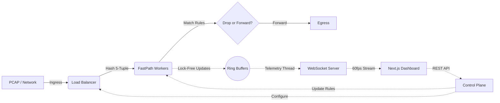

# High-Performance DPI Engine & Telemetry Dashboard

A state-of-the-art Deep Packet Inspection (DPI) and network telemetry platform. This project features a high-throughput **Java FastPath backend** for dissecting packets and a premium, highly-responsive **Next.js 15 dashboard** for real-time visualization and control.

## 📸 Screenshots

| Dark Mode | Light Mode |
| :---: | :---: |
| <br>*(Real-time telemetry and pipeline diagram)* | <br>*(Real-time telemetry and pipeline diagram)* |
| <br>*(Rule editor and worker configuration)* | <br>*(Rule editor and worker configuration)* |
| <br>*(Live tracking of network connections)* | <br>*(Live tracking of network connections)* |

*(Note: Create a `docs/` folder in the root and add screenshots named as above to display them here)*

## 🚀 Key Features

- **FastPath Architecture:** Multi-threaded packet processing engine capable of handling millions of packets per second without dropping frames.
- **Lock-Free Ring Buffers:** Zero-contention telemetry data collection that never blocks the critical data plane.
- **Dynamic Rules Engine:** Apply, update, and remove L3/L4 packet filtering and dropping rules on the fly.
- **Real-Time Telemetry Dashboard:** 
  - Built with **Next.js 15**, **React**, and **Tailwind CSS**.
  - Clean, professional SaaS design aesthetics.
  - Seamless toggle between Light Mode and Dark Mode.
  - Live 60fps throughput charts, individual worker load bars, and active flow tables driven by WebSockets.
- **REST Control Plane:** Safely upload PCAP files, toggle the engine, and configure worker threads via a decoupled REST API.

## 🏗️ System Architecture



## 🛠️ Tech Stack

### Frontend (pcap-dashboard)
- **Framework:** Next.js 15 (App Router)
- **Language:** TypeScript
- **Styling:** Tailwind CSS v4, shadcn/ui
- **State Management:** Zustand
- **Data Visualization:** Recharts, TanStack Table
- **Icons:** Lucide React

### Backend (DPI Engine)
- **Language:** Java 21 (High-Performance FastPath)
- **Packet Processing:** Native bindings / Java PCAP libraries
- **Testing:** Python 3 (Automated end-to-end testing suite)
- **API:** REST (Control Plane) + WebSockets (Data Plane)

## 📦 Getting Started

### 1. Deploy the Frontend Dashboard (Quickest)

You can instantly deploy the frontend dashboard to Vercel for free by clicking the button below:

[](https://vercel.com/new/clone?repository-url=https%3A%2F%2Fgithub.com%2Fdwivedyarvind67%2FDPI&root-directory=pcap-dashboard)

*Note: When deploying, Vercel will automatically detect it's a Next.js app and build it.*

### 2. Run the Frontend Locally
Navigate to the dashboard directory, install dependencies, and start the development server:

```bash
cd pcap-dashboard
npm install
npm run dev
```
The dashboard will be available at [http://localhost:3000](http://localhost:3000).

### 3. Run the Backend Engine Tests
We have built an automated Python test suite that generates PCAP files, compiles the Java engine, and verifies its filtering rules.

Requirements:
- Java JDK 21+
- Python 3.x

```bash
# Generate test traffic and run the Java engine
python test_dpi_engine.py
```
This script will output a detailed summary of the pipeline execution and generate a filtered output file (`output.pcap`).

## 📖 Learn More

Once the dashboard is running, navigate to the **Blog / How It Works** tab in the sidebar to read an in-depth breakdown of the FastPath worker architecture, lock-free ring buffers, and the rules engine!

---

**Author:** Arvind Dwivedi
